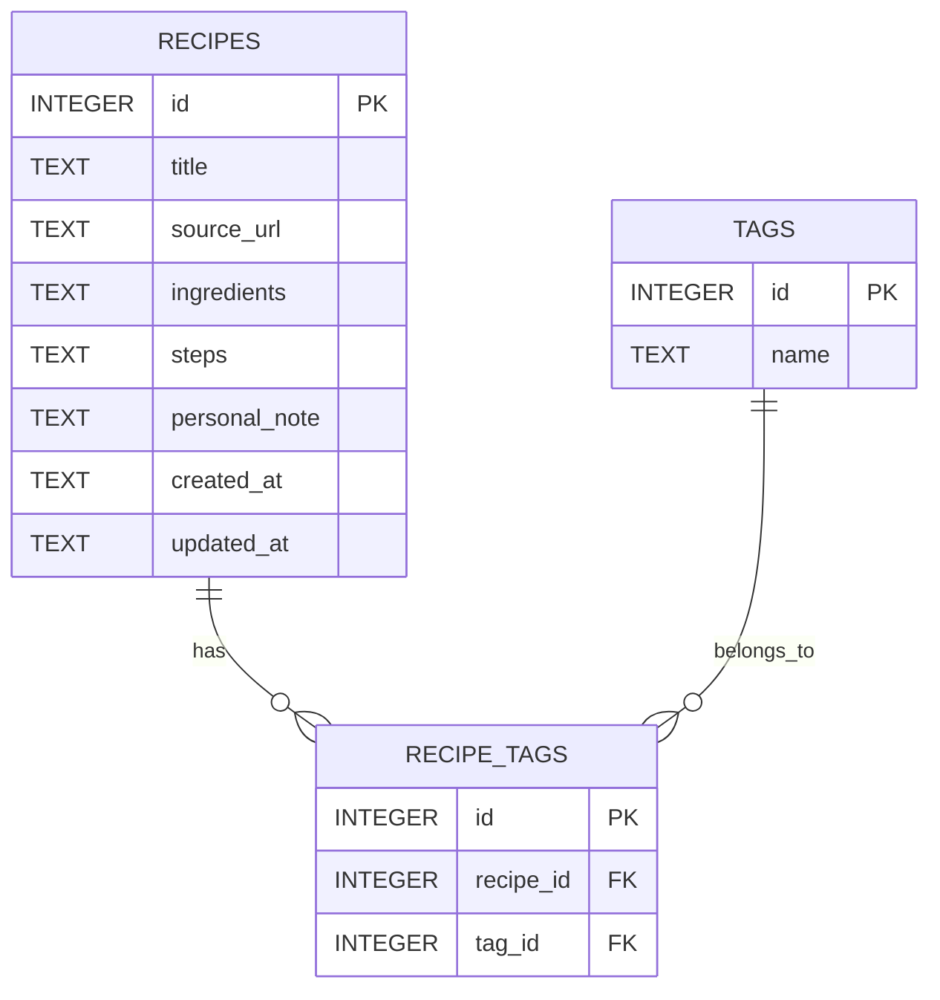

# 資料庫設計文件 (DB_DESIGN)

## 1. ER 圖（實體關係圖）

## 2. 資料表詳細說明

### RECIPES (食譜表)
負責儲存食譜的主要資訊，包含名稱、來源、食材、步驟與個人筆記。
- `id` (INTEGER): Primary Key，自動遞增。
- `title` (TEXT): 食譜名稱，必填。
- `source_url` (TEXT): 來源網址，選填。
- `ingredients` (TEXT): 食材清單（可使用純文字或 JSON 格式儲存），必填。
- `steps` (TEXT): 製作步驟，必填。
- `personal_note` (TEXT): 個人筆記與配方調整，選填。
- `created_at` (TEXT): 建立時間（ISO 8601 格式字串），必填。
- `updated_at` (TEXT): 更新時間（ISO 8601 格式字串），必填。

### TAGS (標籤/分類表)
負責儲存系統中的所有標籤或分類。
- `id` (INTEGER): Primary Key，自動遞增。
- `name` (TEXT): 標籤名稱，必填且唯一。

### RECIPE_TAGS (食譜標籤關聯表)
負責記錄食譜與標籤之間的多對多關聯。
- `id` (INTEGER): Primary Key，自動遞增。
- `recipe_id` (INTEGER): Foreign Key，對應 `recipes.id`，必填。
- `tag_id` (INTEGER): Foreign Key，對應 `tags.id`，必填。

## 3. SQL 建表語法
完整的建表語法請參考 `database/schema.sql`。

## 4. Python Model 程式碼
Model 位於 `app/models/` 目錄中，採用標準 `sqlite3` 套件實作，包含以下檔案：
- `app/models/db.py`: 資料庫連線共用與初始化模組
- `app/models/recipe.py`: 食譜的 CRUD 操作
- `app/models/tag.py`: 標籤與關聯的 CRUD 操作
