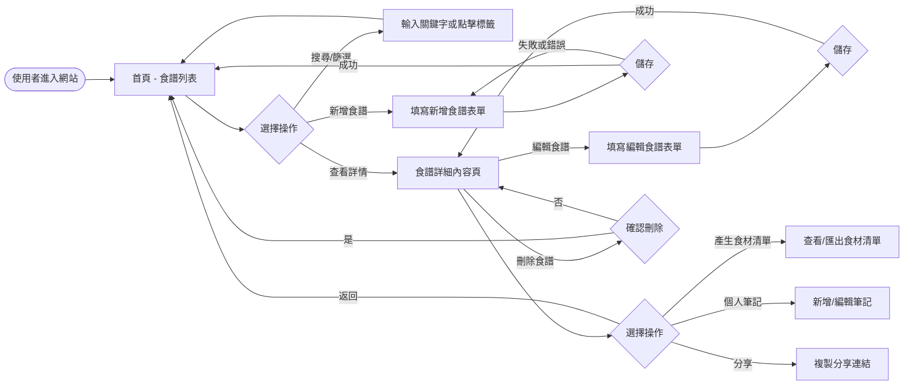
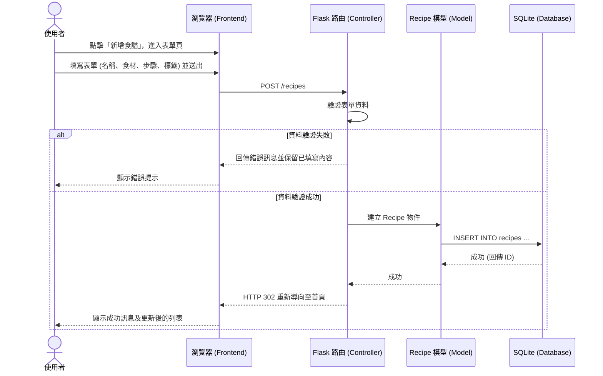

# 系統流程圖文件

本文件根據 PRD 與系統架構設計，梳理出「食譜收藏夾」系統的各項流程。

## 1. 使用者流程圖 (User Flow)

描述使用者進入系統後的主要操作路徑與邏輯分支，涵蓋主要功能如新增、查看、編輯與刪除。

## 2. 系統序列圖 (Sequence Diagram)

以「使用者新增食譜」為例，描述前端操作到後端資料庫的完整互動歷程。

## 3. 功能清單對照表

系統主要功能與對應的路由與 HTTP 方法設計。

| 功能名稱 | URL 路徑 | HTTP 方法 | 說明 |
| -------- | -------- | --------- | ---- |
| 瀏覽首頁/列表 | `/` 或 `/recipes` | GET | 顯示所有食譜，支援查詢參數（搜尋關鍵字、標籤過濾） |
| 新增食譜頁面 | `/recipes/new` | GET | 顯示新增食譜的 HTML 表單 |
| 送出新增食譜 | `/recipes` | POST | 接收表單資料，寫入資料庫並重導向 |
| 查看食譜詳情 | `/recipes/<id>` | GET | 顯示單筆食譜詳細內容、步驟與個人筆記 |
| 編輯食譜頁面 | `/recipes/<id>/edit` | GET | 顯示編輯食譜的 HTML 表單（帶入原有資料） |
| 送出編輯食譜 | `/recipes/<id>` | POST (或 PUT) | 更新特定食譜的資料庫記錄並重導向 |
| 刪除食譜 | `/recipes/<id>/delete` | POST (或 DELETE) | 刪除特定食譜記錄並重導向回列表頁 |
| 查看食材清單 | `/recipes/<id>/ingredients` | GET | (擴充功能) 顯示此食譜對應的採買食材清單 |
